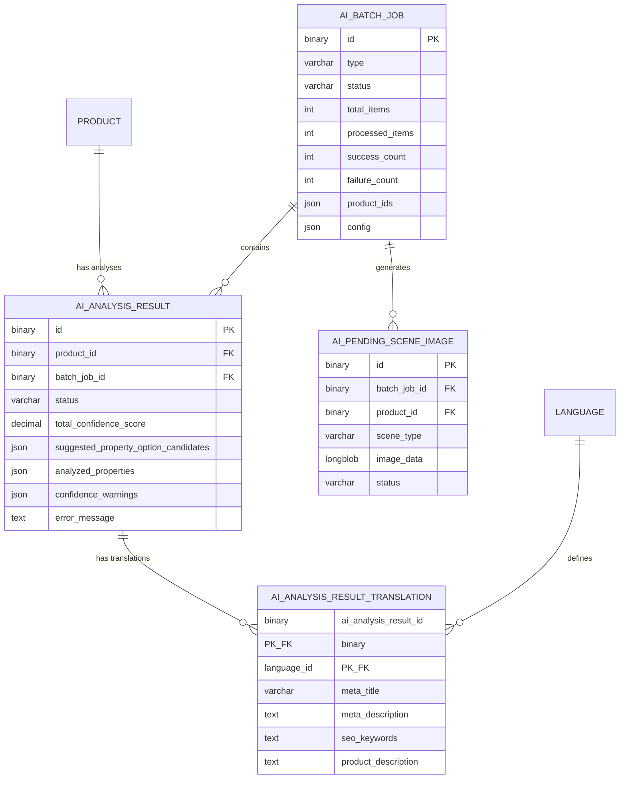

# CMaintzImageAi - Architecture

> **Navigation:** [Overview](./overview.md) | **Architecture** | [API Integration](./api-integration.md) | [Workflows](./workflows.md) | [Admin UI](./admin-ui.md) | [Development](./development.md)

## Design Philosophy

The plugin follows a **unified architecture** - all functionality lives in one Shopware plugin with no external microservices. The plugin communicates directly with Google's Gemini API.

**Key Design Decisions:**
1. **Batch-Only Processing**: Everything is batched (no single-product analysis mode)
2. **Upfront Result Records**: Analysis records created before processing (prevents duplicates on message redelivery)
3. **Schema Enforcement**: API responses must match a predefined JSON schema
4. **Memory Management**: Queue handlers monitor memory and trigger garbage collection

---

## File Structure

```
CMaintzImageAi/
├── src/
│   ├── Api/
│   │   └── Gemini/
│   │       ├── GeminiClient.php              # HTTP client for Gemini API
│   │       └── GeminiResponseParser.php      # Parses API responses into DTOs
│   │
│   ├── Builder/
│   │   ├── Prompt/
│   │   │   ├── BatchAnalysisPromptBuilder.php    # Builds analysis prompts
│   │   │   ├── CompositionPromptBuilder.php      # Builds composition prompts (357 lines)
│   │   │   ├── ScenePromptBuilder.php            # Builds scene generation prompts
│   │   │   └── SystemInstructionBuilder.php      # LLM behavioral guidelines
│   │   └── Schema/
│   │       └── AnalysisSchemaBuilder.php         # Builds response JSON schema
│   │
│   ├── Command/
│   │   ├── AnalyzeAllProductsCommand.php         # CLI: bin/console image-ai:analyze-products
│   │   └── Dev/                                  # Dev commands (remove post-testing)
│   │
│   ├── Config/
│   │   ├── ApiConfiguration.php              # API settings (key, model, URLs)
│   │   ├── ConfidenceConfiguration.php       # Scoring weights and penalties
│   │   ├── ConfigKeys.php                    # String constants for config keys
│   │   ├── ContentConfiguration.php          # Content generation settings
│   │   ├── IlluxConfiguration.php            # Central config service
│   │   ├── PluginConstants.php               # Hardcoded limits and timeouts
│   │   ├── TimeTrackingConfiguration.php     # Time savings calculation
│   │   └── WorkflowConfiguration.php         # Approval workflow settings
│   │
│   ├── Controller/
│   │   ├── Administration/
│   │   │   ├── AnalysisController.php        # Main API controller (11 endpoints)
│   │   │   ├── ApprovalController.php        # Approval/rejection endpoints
│   │   │   ├── PropertyController.php        # Property management
│   │   │   └── SceneGenerationController.php # Scene generation endpoints (7 endpoints)
│   │   └── Storefront/
│   │       └── ImageCompositionController.php
│   │
│   ├── Core/Content/
│   │   ├── AiAnalysisResult/                 # Analysis result entity + translations
│   │   ├── AiBatchJob/                       # Batch job tracking entity
│   │   ├── AiPendingSceneImage/              # Pending scene images entity
│   │   └── AiSceneGenerationConfig/          # Scene generation config entity
│   │
│   ├── DTO/
│   │   ├── Analysis/                         # Analysis result DTOs
│   │   ├── Image/                            # Image DTOs (ResolvedProductImage)
│   │   └── Request/                          # API request DTOs
│   │
│   ├── Factory/
│   │   ├── AnalysisRequestFactory.php
│   │   └── AnalysisSchemaFactory.php
│   │
│   ├── Installers/                           # Plugin installation helpers
│   │
│   ├── Migration/                            # Database migrations
│   │
│   ├── Model/Enum/                           # Status enums
│   │
│   ├── Orchestrator/
│   │   ├── AnalysisOrchestrator.php          # Coordinates batch analysis
│   │   ├── CompositionOrchestrator.php       # Coordinates composition
│   │   └── SceneGenerationOrchestrator.php   # Coordinates scene generation
│   │
│   ├── Queue/
│   │   ├── Handler/
│   │   │   ├── AnalyzeBatchHandler.php
│   │   │   └── GenerateSceneHandler.php
│   │   └── Message/
│   │       ├── AnalyzeBatchMessage.php
│   │       └── GenerateSceneMessage.php
│   │
│   ├── ScheduledTask/
│   │   ├── JobCleanupTask.php
│   │   ├── JobCleanupTaskHandler.php
│   │   ├── ProductAnalysisTask.php
│   │   └── ProductAnalysisTaskHandler.php
│   │
│   ├── Service/
│   │   ├── Analysis/                         # Analysis services
│   │   ├── Approval/                         # Approval services
│   │   ├── Composition/                      # Composition services
│   │   ├── Frame/                            # Frame image resolution
│   │   ├── Media/                            # Media file handling
│   │   ├── Property/                         # Property lookup/mutation
│   │   ├── SceneGeneration/                  # Scene generation config
│   │   ├── BatchJobService.php
│   │   └── LanguageConfigurationService.php
│   │
│   ├── Subscriber/                           # Event subscribers
│   ├── Trait/                                # Shared traits
│   └── Twig/                                 # Twig extensions
│
└── Resources/
    └── app/
        ├── administration/src/               # Admin module
        └── storefront/src/                   # Storefront compositor
```

---

## Database Schema

### Entity Relationship Diagram



### Status Values

**Analysis Status (`AiAnalysisStatusEnum`):**
| Status | Description |
|--------|-------------|
| `Processing` | Currently being analyzed |
| `PendingReview` | Awaiting admin approval |
| `AutoApproved` | Automatically approved (high confidence) |
| `Approved` | Manually approved |
| `Rejected` | Rejected by admin |
| `Failed` | Analysis failed |

**Batch Job Status (`BatchJobStatusEnum`):**
| Status | Description |
|--------|-------------|
| `Queued` | Waiting to process |
| `Processing` | Currently processing |
| `Completed` | Finished successfully |
| `Failed` | Failed with errors |
| `Cancelled` | Cancelled by user |

---

## Key Services

### GeminiClient
HTTP client for all Gemini API communication.

| Method | Purpose |
|--------|---------|
| `analyzeBatch()` | Batch analysis request |
| `compositeImage()` | Single composition |
| `compositeImagesConcurrently()` | Parallel compositions |
| `generateImages()` | Scene generation |

### AnalysisOrchestrator
Main coordinator for batch analysis workflow.

### ConfidenceCalculator
Calculates quality scores (0-100%) using configurable penalties.

### AnalysisApprovalService
Transaction-safe approval/rejection with product updates.

### PropertyLookupService
Cached property lookups (1-hour TTL).

### BatchJobService
Manages batch job lifecycle with upfront record creation.

---

## Configuration System

All settings managed through Shopware SystemConfig, accessible via `IlluxConfiguration` service.

### Configuration Classes

| Class | Purpose |
|-------|---------|
| `IlluxConfiguration` | Central config loader |
| `ApiConfiguration` | API key, model, URLs |
| `ContentConfiguration` | Analysis settings, languages |
| `WorkflowConfiguration` | Approval settings |
| `ConfidenceConfiguration` | All scoring settings (fully configurable) |
| `TimeTrackingConfiguration` | Time savings calculation |

### Key Settings

#### Analysis
| Key | Default |
|-----|---------|
| `metaTitleMaxLength` | 60 |
| `metaDescriptionMaxLength` | 155 |
| `descriptionMaxLength` | 500 |
| `keywordCount` | 5 |
| `analysisLanguages` | "da-DK,en-GB,nn-NO,sv-SE" |

#### Confidence (All Config-Controlled)
| Key | Default |
|-----|---------|
| `enableConfidenceThreshold` | true |
| `lowConfidenceThreshold` | 0.8 |
| `fieldWeightMetaTitle` | 0.25 |
| `fieldWeightMetaDescription` | 0.25 |
| `fieldWeightProductDescription` | 0.20 |
| `fieldWeightSeoKeywords` | 0.15 |
| `fieldWeightProperties` | 0.15 |
| `shortTitlePenalty` | 0.05 |
| `genericContentPenalty` | 0.08 |
| `hedgingPenaltyPerInstance` | 0.03 |
| `hedgingPenaltyMax` | 0.10 |
| `duplicateContentPenalty` | 0.10 |
| `emptyPropertyPenalty` | 0.15 |
| `maxTotalPenalty` | 0.40 |

#### Workflow
| Key | Default |
|-----|---------|
| `enableApprovalWorkflow` | true |
| `scheduledTaskEnabled` | true |
| `scheduledTaskInterval` | 8 (hours) |

#### Time Tracking
| Key | Default | Description |
|-----|---------|-------------|
| `minutesSavedPerProperty` | 2 | Minutes saved per property assignment |
| `minutesSavedPerSeo` | 3 | Minutes saved per SEO field |
| `minutesSavedForBaseDescription` | 5 | Minutes saved for primary description |
| `minutesSavedPerAdditionalTranslation` | 2 | Minutes saved per additional language |

---

## Critical Design Decisions

### 1. Batch-Only Processing
No single-product mode. Even one product goes through batch system.

### 2. Upfront Result Records
Create `AiAnalysisResult` BEFORE processing to prevent duplicates on message redelivery.

### 3. Schema Enforcement
Enforce JSON schema on API responses via `generationConfig.responseSchema`.

### 4. Confidence-Based Workflow
Calculate scores, optionally auto-approve high-confidence results.

### 5. Memory Management
Monitor memory in handlers, trigger GC at 128MB threshold.

---

*Last Updated: December 2025*
